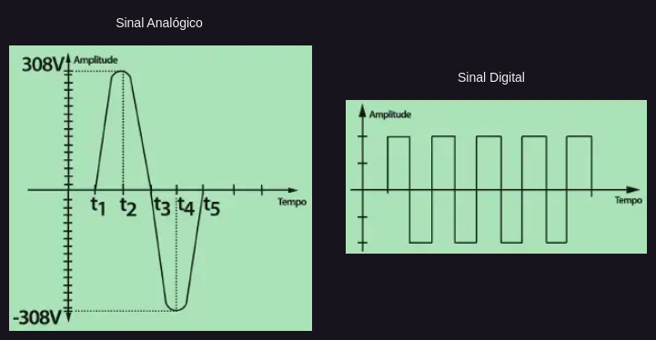

# O que é a eletrônica

A eletrônica consiste no ramo da Física que se incumbe de estudar os fenômenos relacionados à condução da corrente elétrica nos diversos tipos de materiais, quer sejam no estado sólido, líquido ou gasoso.

A invenção dos transistores e dos circuitos integrados permitiram o desenvolvimento da Eletrônica Digital.

Válvulas, diodos, transistores e os circuitos integrados

As válvulas deram lugar aos transistores

## Diferenças entre a eletrônica analógica (ou linear) e a eletrônica digital

A diferenciação é feita tendo como base o tipo de **sinal elétrico** manipulado. A eletrônica analógica é o ramo da eletrônica que manipula sinais analógicos, como a transmissão de sinal de rádio e TV, reprodução sonora de áudio em geral. A eletrônica digital é o ramo da eletrônica que manipula sinais digitais, como relógios digitais, os sistema de controle remoto para TV e videocassete, os microprocessadores empregados nos microcomputadores.
O mesmo vale para os circuitos - circuitos digitais são aqueles que manipulam **sinais digitais**, enquanto circuitos analógicos manipulam **sinais analógicos**.

## Sinal analógico

Um sinal é analógico quando a sua amplitude (valor de tensão) varia, no decorrer do tempo, linearmente, ou seja, de um modo contínuo, assumindo todos os valores possíveis compreendidos entre um nível máximo e um nível mínimo.

Como exemplo, o sinal gerado pela rede elétrica, que consiste em uma tensão senoidal cuja frequência é bem precisa é de valor igual a 60 Hertz (no Brasil).

